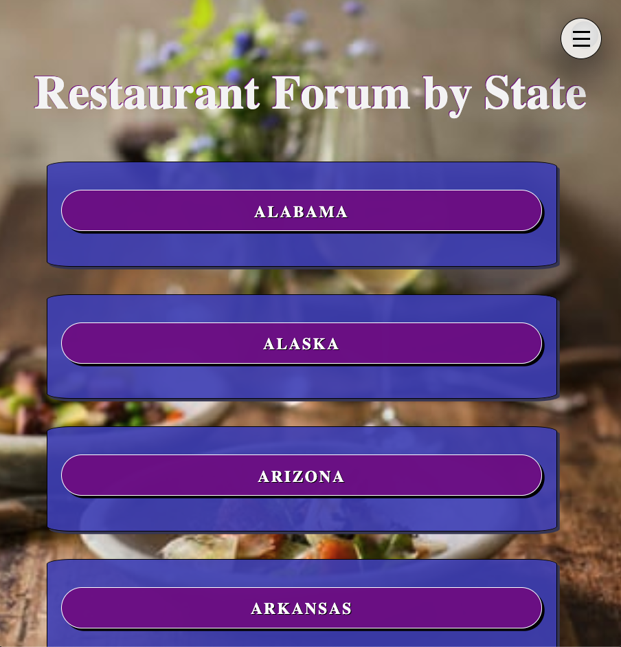
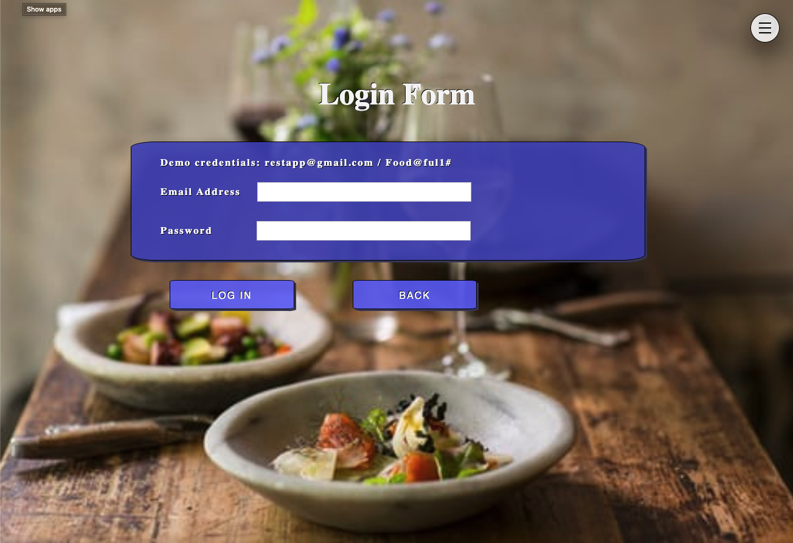

# Restaurant Forum API

This RESTful API controls all interactions between the front end Restaurant Forum app and the database.






## Technology

This API was built using Node, Express and Knex. The database was built using PostgreSQL.

## Client Repo

https://github.com/thorn086/restaurant-forum-app

## Live Site

https://restaurant-forum-app.now.sh/

# Using this API

## Add User
Adds user to database

## URL
```javascript
/api/users
```
* Method
```
POST
```
* Body Params\
  First name\
  Last name\
  User email\
  Password

* Success Response\
  Code: 201

* Error Response\
  Code: 400

* Sample Call
  ```javascript
  fetch(`${API.API_ENDPOINT}/users`, {
    method: 'POST',
    headers: {
      'content-type': 'application/json',
    },
    body: JSON.stringify(user),
  })
  ```

***

## Login
Authenticates user login credentials

## URL
```javascript
/api/auth
```
* Method
```
POST
```
* Body Params\
  User email\
  Password

* Success Response\
  Code: 200\
  Content:
  ```
  {
    authToken: 'authToken',
    userId: 'userId'
  }
  ```

* Error Response\
  Code: 400

* Sample Call
  ```javascript
  fetch(`${API.API_ENDPOINT}/auth/login`, {
    method: 'POST',
    headers: {
      'content-type': 'application/json',
    },
    body: JSON.stringify({ user_email, password }),
  })
  ```

***

## URL
```javascript
/api/states
```
* Method
```
GET
```
* Body Params
  None

* Success Response\
  Code: 200\
  Content:
  ```
  {
    states: 'states'
  }
  ```

* Error Response\
  Code: 400

* Sample Call
  ```javascript
     fetch(`${config.API_ENDPOINT}/states`, {
      method: 'GET',
      headers: {
        'content-type': 'application/json',
      }
    })
      .then(stateResult => {
        if (!stateResult.ok)
          throw new Error(stateResult.statusText)

        return stateResult.json()
      })
  ```

***

## URL
```javascript
/api/city
```
* Method
```
GET
```
* Body Params\
 id

* Success Response\
  Code: 201

* Error Response\
  Code: 400

* Sample Call
  ```javascript
    fetch(`${config.API_ENDPOINT}/states/${id}`)
            .then(res => {
                if (res.ok)
                    return res.json()
                throw new Error(res.statusText)

            })
  ```
***

  ## URL
```javascript
/api/city/id
```
* Method
```
POST
```

* URL Params\
  ```
  none
  ```

* Body Params\
  name\
  state_id\
  author\

* Success Response\
  Code: 204

* Error Response\
  Code: 404\
  Content:
  ```
  {
    error: `There are no restaurants in this city, you can add one.`
  }
  ```

* Sample Call
  ```javascript
    fetch(`${config.API_ENDPOINT}/states/${id}`, {
            method: 'POST',
            headers: {
                'content-type': 'application/json',
                'authorization': `bearer ${TokenService.getAuthToken()}`
            },
            body: JSON.stringify(newCity),
        })
  ```
 ## URL
```javascript
/api/city/id
```
* Method
```
DELETE
```

* URL Params\
  ```
  remove a city form state
  ```

* Body Params\
  none

* Success Response\
  Code: 204

* Error Response\
  Code: 404\
  Content:
  ```
  {
    error: `There are no cities in this state, you can add one.`
  }
  ```

* Sample Call
  ```javascript
    fetch(`${config.API_ENDPOINT}/states/${citySelected}`,{
            method:'DELETE',
            headers:{
            'content-type':'application/json',
            'authorization':`bearer ${TokenService.getAuthToken()}`
        },
    })
  ```

## URL
```javascript
/api/restaurant/
```
* Method
```
GET
```

* URL Params\
```
none
```

* Body Params\
  

* Success Response\
  Code: 204

* Error Response\
  Code: 404\
  Content:
```
  {
    error: `There are no restaurants in this city, you can add one.`
  }
```

* Sample Call
  ```javascript
  fetch(`${config.API_ENDPOINT}/restaurant`,{
        method:'GET',
        headers:{
           'Authorization': `bearer ${TokenService.getAuthToken()}`
        }
    })
  ```
## URL
```javascript
/api/restaurant/id
```
* Method
```
POST
```

* URL Params\
  ```
  post restaurant to a city
  ```

* Body Params\
  name\
  address\
  phone\
  state_id\
  city_id\
  comments\

* Success Response\
  Code: 204

* Error Response\
  Code: 404\
  Content:
  ```
  {
    error: `There are no restaurants in this city, you can add one.`
  }
  ```

* Sample Call
  ```javascript
  fetch(`${config.API_ENDPOINT}/city/${id}`, {
            method: 'POST',
            headers: {
                'content-type': 'application/json',
                'authorization': `bearer ${TokenService.getAuthToken()}`
            },
            body: JSON.stringify(newRestaurant),
        })
  ```
  ## URL
```javascript
/api/editrestaurant/id
```
* Method
```
PATCH
```

* URL Params\
  ```
  id
  ```

* Body Params\
  address\
  phone\
  comments\

* Success Response\
  Code: 204

* Error Response\
  Code: 404\
  Content:
  ```
  {
    error: `There are no restaurants in this city, you can add one.`
  }
  ```

* Sample Call
  ```javascript
  fetch(`${config.API_ENDPOINT}/editrestaurant/${id}`, {
      method: 'PATCH',
      headers: {
        'content-type': 'application/json',
        'Authorization': `bearer ${TokenService.getAuthToken()}`
      },
      body: JSON.stringify(updatedRestaurant)
    })
  ```